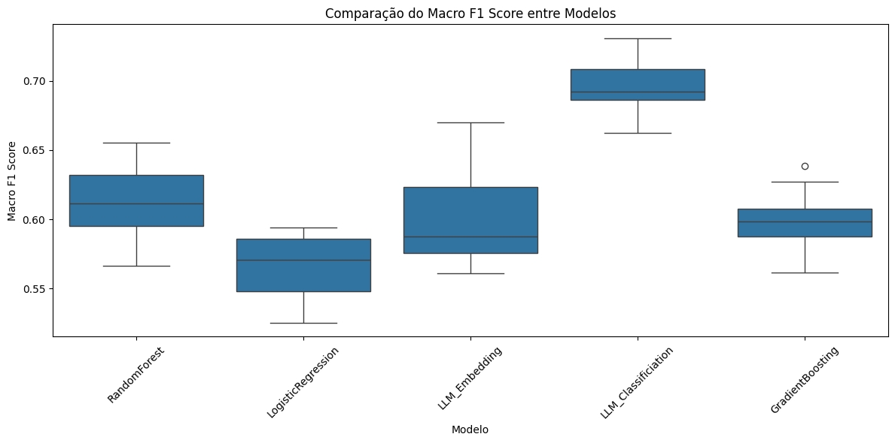
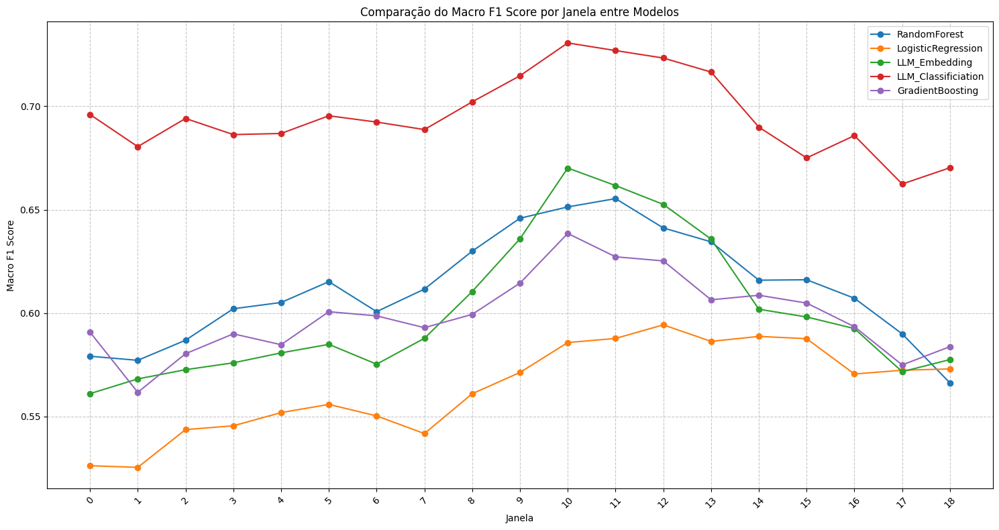

<div align="center">
<table>
  <tr>
    <td align="center"></td>
    <td align="center"></td>
  </tr>
</table>
</div>

# Table of Contents

- [Previsão de Resultados de Conciliação em Decisões Judiciais](#previsão-de-resultados-de-conciliação-em-decisões-judiciais)
- [Overview](#overview)
- [Motivation](#motivation)
- [Data Description](#data-description)
- [Methodology](#methodology)
  - [Classical Machine Learning Approach](#classical-machine-learning-approach-baseline-approach)
  - [Large Language Models Approach](#large-language-models-approach)
- [Results](#results)
- [Conclusions](#conclusions)
- [References](#references)
- [Running the Project](#running-the-project)
  - [Locally on a Linux Terminal](#locally-on-a-linux-terminal)
  - [Automated Execution with GitHub Actions](#automated-execution-with-github-actions)
    - [How It Works](#how-it-works)
    - [How to Trigger the Workflow Manually](#how-to-trigger-the-workflow-manually)
- [Article Versioning](#article-versioning)
- [Contact](#contact)

# Previsão de Resultados de Conciliação em Decisões Judiciais

This repository contains the code and analysis from the research project **"Previsão de Resultados de Conciliação em Decisões Judiciais na Vara do Trabalho do Espírito Santo"** by Luís Eduardo Freire da Câmara. The project investigates methods to predict conciliation outcomes in labor court cases using both classical machine learning techniques and state-of-the-art Large Language Models (LLMs).

## Overview

The Brazilian labor justice system faces a significant increase in case volume, with new processes rising by 28.7% in 2023. Conciliation plays a critical role in resolving cases efficiently; however, predicting which cases will be resolved via conciliation remains challenging. This work compares traditional natural language processing (NLP) techniques with LLM-based approaches to forecast whether a labor case will be settled through conciliation or by judicial sentence.

## Motivation

- **Judicial Overload:** With millions of cases, the system is under pressure.
- **Efficiency:** Early prediction of conciliation can help allocate judicial resources better.
- **Innovation:** Leveraging LLMs shows promise for capturing nuanced semantic information from legal texts, potentially outperforming traditional models.

## Data Description

The dataset consists of essential information for predicting conciliation outcomes in labor cases, organized into three main categories:

- **Identification and Classification:** Unique process identifiers and litigation types.
- **Economic and Party Characteristics:** Details such as the value of the claim, the nature of the parties (public or private), and the number of claimants/defendants.
- **Temporal and Outcome Data:** Dates of filing and judgment, and a binary indicator for conciliation (1) or judicial sentence (0).

Additional textual features include details like the Labor Court, Activity Branch, Procedural Class, Origin City, OAB information, subjects, and associated documents.

## Methodology

The project explores two primary approaches for predicting case outcomes:

### 1. Classical Machine Learning Approach (Baseline)
- **Preprocessing:** 
  - Removal of null entries and duplicates.
  - Conversion to lowercase, tokenization, and stopwords removal.
- **Windowing Strategy:** 
  - Data is divided into overlapping 2-year windows (with a 6-month shift) to capture temporal patterns.
- **Model Training:** 
  - Techniques such as Logistic Regression, Random Forest, and Gradient Boosting are applied.
  - Target encoding with smoothing is used to handle categorical text features.
  - Models are evaluated using metrics like accuracy, precision, recall, and F1-macro score.

### 2. Large Language Models (LLM) Approaches
- **LLM Feature Extraction:**
  - Texts are tokenized and processed using BERTimbau (a BERT model pre-trained on Portuguese) to extract high-dimensional embeddings.
  - A Random Forest classifier is then trained on these embeddings.
- **LLM Classification with HuggingFace Trainer:**
  - A pre-trained sequence classification model is fine-tuned using the HuggingFace Trainer.
  - This approach integrates tokenization, dataset conversion, and model training in one streamlined process.


## Results

- **Traditional Models:** Achieved F1-macro scores between 0.60 and 0.65.
- **LLM Approaches:** 
  - The feature extraction method reached scores around 0.67.
  - The LLM classification approach achieved scores frequently above 0.70, demonstrating improved performance and lower dispersion in results.
 





## Conclusions

The study demonstrates that incorporating LLMs into judicial prediction models significantly enhances performance compared to classical approaches. Although LLMs introduce challenges such as increased computational costs and complexity, their ability to capture semantic nuances makes them a promising tool for aiding judicial decision-making.

## References

- Lage-Freitas, A., Allende-Cid, H., Santana, O., & de Oliveira-Lage, L. (2019). *Predicting Brazilian Court Decisions.* [arXiv:1905.10348](https://arxiv.org/abs/1905.10348)
- Additional literature on legal decision prediction and related machine learning techniques.
- Documentation for the libraries and tools used (e.g., scikit-learn, pandas, numpy, NLTK).

# Running the Project

### Locally on a Linux Terminal

To run the project on your Linux machine, follow these steps:

1. **Clone the repository:**

   ```bash
   git clone https://github.com/LuisEduardoF/Conciliamento_TRT.git
   cd Conciliamento_TRT
   ```
2. **Install dependecies:**
  Make sure you have Python (3.10) installed, then install the required packages:

    ```bash
    pip install --upgrade pip
    pip install -r requirements.txt
   ```
3. **Run the analysis scripts:**
   ```bash
     python -u classical_analysis/model.py
     python -u llm_analysis/llm_embedding.py
     python -u llm_analysis/llm_classification.py
    ```
   This will execute the methodology and print the outputs directly in your terminal.

### Automated Execution with GitHub Actions
This repository includes a GitHub Actions workflow that lets you manually execute three Python scripts:

- `classical_analysis/model.py`: Classical Methodology
- `llm_analysis/llm_embedding.py`: Feature extractraction with BERTimbau
- `llm_analysis/llm_classification.py`: BERTimbau with a classifier head (NLP)

### How It Works

The workflow is configured with the `workflow_dispatch` trigger. This means it will only run when you manually start it from the GitHub Actions tab. The workflow does the following:

1. **Checks Out the Repository:**  
   It downloads the latest version of your code.

2. **Sets Up Python:**  
   It installs the specified Python version (3.10).

3. **Installs Dependencies:**  
   It installs the packages listed in `requirements.txt`.

4. **Runs the Scripts:**  
   It executes each of the three Python scripts in sequence.

### How to Trigger the Workflow Manually

1. **Commit and Push the Workflow File:**  
   Ensure that the workflow file (e.g., `.github/workflows/run-scripts.yml`) is committed to your repository.

2. **Navigate to the Actions Tab:**  
   In your GitHub repository, click on the **Actions** tab at the top.

3. **Select the Workflow:**  
   Find the workflow titled **"Run Python Analysis Scripts"** (or the name you gave it) in the list.

4. **Run the Workflow:**  
   Click on the **"Run workflow"** button. You might be prompted to confirm; go ahead and start the workflow.

5. **Monitor Execution:**  
   You can view the logs and output of each step by clicking on the running workflow.

The Action tab: [Action List](https://github.com/LuisEduardoF/Conciliamento_TRT/actions)

---

## Article Versioning

The project uses a versioning system for its article documentation, stored on the project’s wiki under **[VER] Articles versioning** ! [Article Versioning](https://github.com/LuisEduardoF/Conciliamento_TRT/wiki/%5BVER%5D-Articles-versioning). Each version corresponds to a specific stage in the development of the article:

- **(W) Work:**  
  Draft versions or college works articles.
- **(TH) Thesis:**  
  Versions that are formatted or refined for thesis submission.
- **(P) Publication:**  
  Finalized versions intended for publication.

### Contact
For questions or further information, please contact Luís Eduardo Freire da Câmara at [luis.camara@edu.ufes.br].
